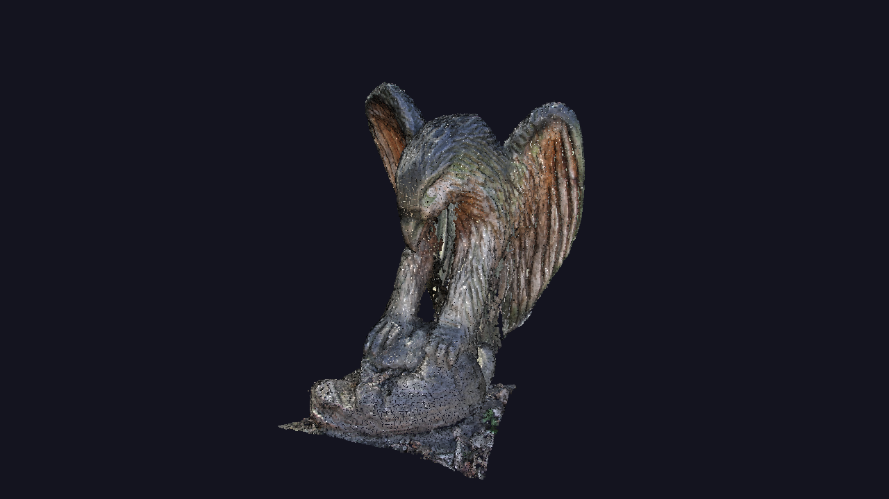
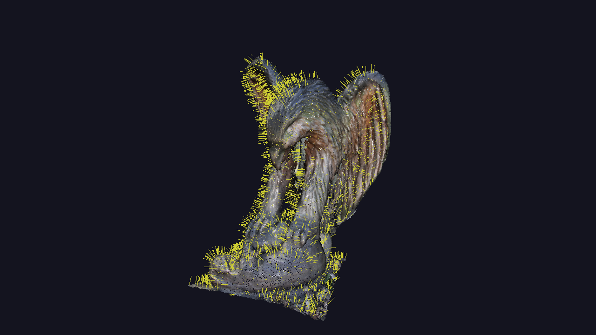
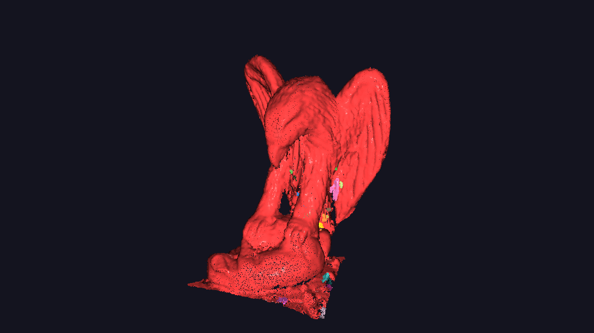
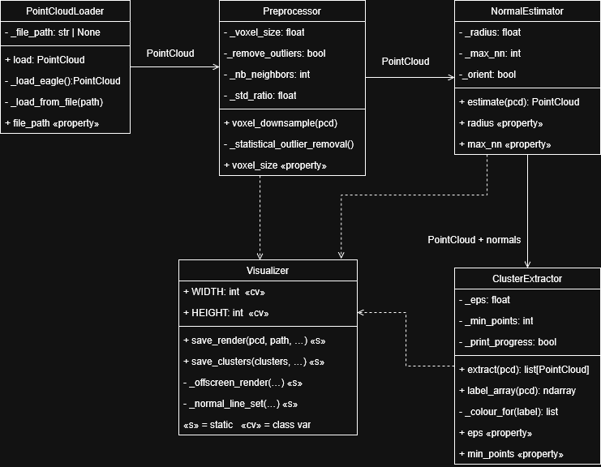

# Point Cloud Processing Pipeline

A 3D point cloud processing pipeline built with [Open3D](https://www.open3d.org/), demonstrating geometric downsampling, surface normal estimation, and Euclidean clustering on the Eagle dataset.

---

## Sample Outputs

### Downsampled Cloud


### Surface Normals


### Clusters


---

## Table of Contents

1. [Setup Instructions](#setup-instructions)
2. [How to Run](#how-to-run)
3. [Code Architecture](#code-architecture)
4. [Pipeline Description](#pipeline-description)
5. [Running Tests](#running-tests)
6. [Project Structure](#project-structure)

---

## Setup Instructions

### Prerequisites

- Python 3.9 or newer
- pip

### Install

```bash
# Clone the repository
git clone https://github.com/danliew123/point-cloud-processing.git
cd point-cloud-processing

# Create and activate a virtual environment
python -m venv .venv
source .venv/bin/activate        # Mac/Linux
.venv\Scripts\activate           # Windows

# Install dependencies
pip install -r requirements.txt
```

> On first run, Open3D will automatically download and cache the Eagle dataset (~6 MB).

---

## How to Run

### Default run

```bash
python main.py
```

Output images are saved to the `outputs/` directory:

| File | Contents |
|---|---|
| `outputs/downsampled.png` | Voxel-downsampled point cloud |
| `outputs/normals.png` | Cloud with surface normal lines rendered |
| `outputs/clusters.png` | Segmented clusters, each a distinct colour |

### Custom parameters

```bash
python main.py \
  --voxel-size 0.03 \
  --normal-radius 0.15 \
  --normal-max-nn 30 \
  --cluster-eps 0.08 \
  --cluster-min-points 25 \
  --output-dir outputs
```

| Argument | Default | Description |
|---|---|---|
| `--voxel-size` | `0.03` | Voxel cell edge length for downsampling |
| `--normal-radius` | `0.15` | Neighbourhood radius for normal estimation |
| `--normal-max-nn` | `30` | Max neighbours for normal estimation |
| `--cluster-eps` | `0.08` | DBSCAN neighbourhood radius |
| `--cluster-min-points` | `25` | Minimum points to form a cluster |
| `--output-dir` | `outputs` | Directory to save rendered PNG images |

---

## Code Architecture

The pipeline is structured around five single-responsibility classes, each encapsulating one stage of processing. All classes are independently testable and take their configuration through constructor arguments rather than hardcoded values.

### UML Class Diagram




### Class Summary

| Class | File | Responsibility |
|---|---|---|
| `PointCloudLoader` | `src/loader.py` | Loads the Eagle dataset or a local file |
| `Preprocessor` | `src/preprocessor.py` | Voxel downsampling and optional outlier removal |
| `NormalEstimator` | `src/normal_estimator.py` | Per-point surface normal estimation |
| `ClusterExtractor` | `src/cluster_extractor.py` | DBSCAN clustering, colours each cluster |
| `Visualizer` | `src/visualizer.py` | Headless off-screen PNG rendering |

### Pipeline Data Flow

```
EaglePointCloud()
      │
      ▼
PointCloudLoader.load()
      │  PointCloud (796,825 points, RGB)
      ▼
Preprocessor.voxel_downsample() --->  Visualizer.save_render()  →  downsampled.png
      │  PointCloud (171,015 points)
      ▼
NormalEstimator.estimate() --->  Visualizer.save_render()  →  normals.png
      │  PointCloud (with normals)
      ▼
ClusterExtractor.extract() --->   Visualizer.save_clusters() →  clusters.png
      │  list[PointCloud] (~24 coloured clusters)
      ▼
      Done
```

### OOP Principles Applied

- **Encapsulation** — configuration is stored in private attributes with read-only properties exposed publicly
- **Single Responsibility** — each class handles exactly one pipeline stage
- **Immutability** — no class mutates its input; all operations return new `PointCloud` objects
- **Dependency Injection** — parameters are passed at construction time, making each class independently testable
- **Static Utility Pattern** — `Visualizer` uses `@staticmethod` methods as a pure utility namespace with no internal state

---

## Pipeline Description

### Stage 1 – Loading (`PointCloudLoader`)

Loads the Eagle point cloud using `o3d.data.EaglePointCloud()`, which downloads and caches a high-resolution RGB scan of an eagle statue (~796,000 points). The loader wraps this behind a clean `.load()` interface and also supports loading from a local `.pcd` or `.ply` file via the constructor.

### Stage 2 – Downsampling (`Preprocessor`)

Applies voxel grid downsampling with `voxel_size=0.03`. The algorithm divides 3D space into uniform cubic cells and replaces all points within each cell with their centroid. This reduces the cloud from ~796,000 to ~171,000 points while preserving the macro-scale geometry of the statue. The Eagle dataset spans roughly 8.6 units in its largest dimension, so a voxel size of 0.03 units gives a meaningful reduction without losing shape detail.

### Stage 3 – Normal Estimation (`NormalEstimator`)

Estimates a surface normal vector for every point using PCA on local neighbourhoods found via a hybrid KD-tree search (bounded by both `radius=0.15` and `max_nn=30`). Normals are then consistently oriented to face the coordinate origin to resolve the sign ambiguity inherent in PCA-based estimation. The yellow normal lines visible in the render confirm that normals correctly follow the surface curvature of the statue.

### Stage 4 – Clustering (`ClusterExtractor`)

Segments the cloud using DBSCAN with `eps=0.08` and `min_points=25`. The eagle statue forms one dominant connected surface (the largest cluster, shown in red), which is the expected result for a single-object scan. The remaining ~23 smaller clusters correspond to geometrically detached fragments around the base and lower body, regions where the scan has gaps that DBSCAN cannot bridge at the chosen epsilon. Each cluster is assigned a distinct colour and returned sorted by descending size.

### Stage 5 – Visualisation (`Visualizer`)

Renders each pipeline stage to a 1280×720 PNG using Open3D's headless off-screen renderer, no display or GUI required. The normals render includes sampled yellow normal lines drawn as a `LineSet` on top of the point cloud. All three output images are saved to the `outputs/` directory.

---

## Running Tests

```bash
pytest tests/ -v
```

| Test | Description |
|---|---|
| `test_load_returns_nonempty_cloud` | Dataset loads successfully with points |
| `test_voxel_downsample_reduces_point_count` ⭐ | Downsampled cloud has fewer points than original |
| `test_invalid_voxel_size_raises` | Non-positive voxel size raises `ValueError` |
| `test_estimate_populates_normals` | Every point receives a normal vector |
| `test_clustering_produces_multiple_segments` ⭐ | More than one cluster is found |
| `test_clusters_sorted_largest_first` | Clusters returned in descending size order |

⭐ Required tests specified in the assignment.

---

## Project Structure

```
point-cloud-processing/
├── main.py                    # Entry point, orchestrates the pipeline
├── requirements.txt           # Pinned dependencies
├── README.md
├── src/
│   ├── __init__.py
│   ├── loader.py              # PointCloudLoader
│   ├── preprocessor.py        # Preprocessor
│   ├── normal_estimator.py    # NormalEstimator
│   ├── cluster_extractor.py   # ClusterExtractor
│   └── visualizer.py          # Visualizer
├── tests/
│   ├── __init__.py
│   └── test_pipeline.py       # Unit tests (pytest)
├── docs/
│   ├── uml_class_diagram.png
│   └── uml_class_diagram.drawio
└── outputs/                   # Generated on first run
    ├── downsampled.png
    ├── normals.png
    └── clusters.png
```